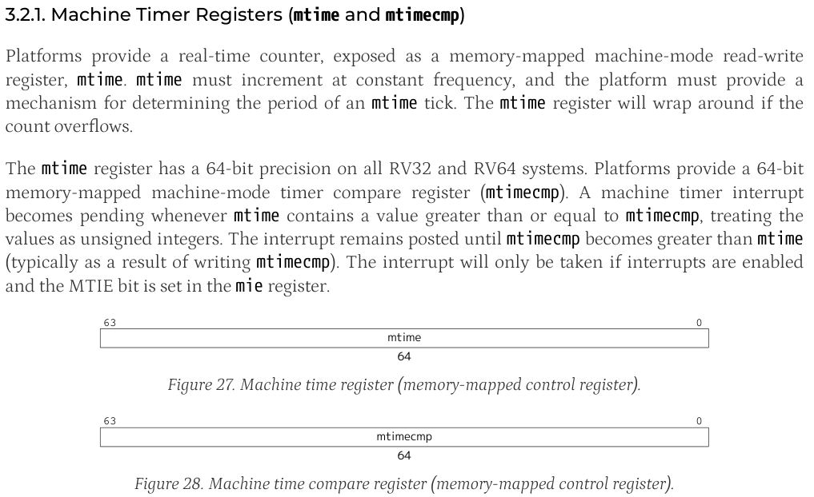

# Uno-OS

## 简介
Uno-OS是一个基于MIT的xv6实验开发的，RISCV架构的简化版UNIX操作系统。

## 时钟中断的实现

### 原理
在RISCV架构中，内存的`CLINT`区域中，有一个`MTIME`区域（详见`memlayout.h`）。该区域储存了系统的时钟周期数，每次时钟周期数递增1。此外，还有一个`MTIMECMP`区域，该区域用于和`MTIME`计数器进行比较，如果发现`MTIME`计数器的值大于等于`MTIMECMP`，则会触发一次时钟中断。



### 注册M模式中断处理函数
根据RISCV规范，在M模式下发生中断时，CPU会跳转到`mtvec`寄存器指定的地址执行中断处理函数。我们需要中断处理函数完成下面的工作：
1. 保存相关寄存器
2. 触发SSI，将M模式下的时钟中断委托给S模式下的中断处理函数处理。
3. 将`MTIME`的值增加`TIMER_INTERVAL`，从而在一定时间后触发下一个时钟中断。
下面这个函数完成了上述操作：
``` asm
# M-mode 中断处理(只包括时钟中断)
.globl timer_vector
.align 4
timer_vector:

        # 暂存寄存器 a0 a1 a2 a3
        # 将MSR寄存器 mscratch 放入 a0
        csrrw a0, mscratch, a0
        sd a1, 0(a0)      # mscratch[0] = a1
        sd a2, 8(a0)      # mscratch[1] = a2
        sd a3, 16(a0)     # mscratch[2] = a3

        # *(uint64)CLINT_MTIMECMP(current_cpuid)=*(uint64*)CLINT_MTIME+TIMER_INTERVAL;
        # 以便响应下一次时钟中断
        ld a1, 24(a0)     # a1 = mscratch[3] 里面放了 CLINT_MTIMECMP(hartid)
        ld a2, 32(a0)     # a2 = mscratch[4] 里面放了 TIMER_INTERVAL        
        ld a3, 0(a1)
        add a3, a3, a2
        sd a3, 0(a1)

        # 引发一个 S-mode software interrupt
        li a1, 2
        csrw sip, a1

        # 恢复寄存器 a0 a1 a2 a3
        # 将 mscratch 寄存器恢复
        ld a3, 16(a0)
        ld a2, 8(a0)
        ld a1, 0(a0)
        csrrw a0, mscratch, a0

        mret      
```
这里的`.align 4`是因为`mtvec`要求给定的地址四字节对齐。

在`timer_init`中，我们注册`mtvec`，并允许时钟中断：
``` c
// 时钟初始化
// called in start.c
void timer_init()
{
    int current_cpuid=r_mhartid();

    // 时钟中断的频率由TIMER_INTERVAL的值指定
    *(uint64*)CLINT_MTIMECMP(current_cpuid)=*(uint64*)CLINT_MTIME+TIMER_INTERVAL;

    // 接下来的目标：将时钟中断处理函数timer_vector的位置写入mtvec中以及将时钟中断相关参数写入mscratch中
    // 同名的寄存器中会存储指向该数组的指针
    // trap.S中我们已经说明了mscratch数组中五个元素的意义：
    // 0..2 分别存储了a1,a2,a3寄存器的值（起暂存作用）
    // 3 存储着CLINT_MTIMECMP的地址
    // 4 存储TIMER_INTERVAL
    mscratch[current_cpuid][3]=CLINT_MTIMECMP(current_cpuid);
    mscratch[current_cpuid][4]=TIMER_INTERVAL;
    w_mscratch((uint64)mscratch[current_cpuid]);
    w_mtvec((uint64)timer_vector);

    // 设置允许M模式下的时钟中断
    w_mstatus(r_mstatus() | MSTATUS_MIE);
    w_mie(r_mie()|MIE_MTIE);

}
```

### 注册S模式中断处理函数
为了完成M模式下的时钟中断处理，我们还要注册S模式下的中断处理函数，以响应`timer_vector`中触发的SSI。
``` c
// in trap.S
// 内核中断处理流程
extern void kernel_vector();

// 初始化trap中全局共享的东西
void trap_kernel_init()
{
    timer_create();
}

// 各个核心trap初始化
// 即设置stvec寄存器，发生中断跳转到kernel_vector函数处理
void trap_kernel_inithart()
{
    w_stvec((uint64)kernel_vector);

    intr_on();
    mycpu()->noff = 0; //强制打开
}
```
`trap_kernel_init()`用于初始化系统时钟，与注册S模式中断处理函数无关，注册的工作主要由`trap_kernel_inithart()`函数完成。它将`kernel_vector()`地址写入`stvec`中并允许S模式中断。`kernel_vector()`在`trap.S`中定义，它完成了
1. 保存寄存器
2. 调用`trap_kernel_handler()`

的工作。
``` asm
# S-mode 中断处理 (包括软件中断和外设中断)
.globl kernel_vector
.align 4
kernel_vector:

        # 准备空间给32个通用寄存器
        addi sp, sp, -256

        # 寄存器状态保存
        # （省略）

        # trap的处理过程
        call trap_kernel_handler

        # 寄存器状态恢复
        # （省略）

        # 栈指针恢复
        addi sp, sp, 256

        # 当前处于S-mode,返回调用者
        sret
```

`trap_kernel_handler()`函数则完成了中断处理的真正工作，它根据`scause`寄存器的值判断是何种类型的中断，然后调用对应的中断处理函数。

``` c
// 在kernel_vector()里面调用
// 内核态trap处理的核心逻辑
void trap_kernel_handler()
{
    uint64 sepc = r_sepc();          // 记录了发生异常时的pc值
    uint64 sstatus = r_sstatus();    // 与特权模式和中断相关的状态信息
    uint64 scause = r_scause();      // 引发trap的原因
    uint64 stval = r_stval();        // 发生trap时保存的附加信息(不同trap不一样)

    // 确认trap来自S-mode且此时trap处于关闭状态
    assert(sstatus & SSTATUS_SPP, "trap_kernel_handler: not from s-mode");
    assert(intr_get() == 0, "trap_kernel_handler: interreput enabled");

    int trap_id = scause & 0xf; 

    // 暂未实现对异常的处理
    assert(IS_INTR(scause),"Unhandled exception,\n\tsepc:%x,scause:%x,sstatus:%x,stval:%x\n\tdescription:%s"
                ,sepc,scause,sstatus,stval,exception_info[trap_id]);

    // 中断异常处理核心逻辑

    // M模式下的时钟中断会触发S模式下的软件中断，因此判断trap_id是否为SMODE_SOFTWARE_INTERRUPT即可
    // 新增中断处理表项时需在trap/intrno.h中添加常量定义，不要使用magic number.
    switch(trap_id)
    {
        case SMODE_SOFTWARE_INTERRUPT:
            timer_interrupt_handler();
            break;
        case SMODE_EXTERNAL_INTERRUPT:
            external_interrupt_handler();
            break;
        default:
            panic("Unknown trap id %x,\n\tdescription:%s",trap_id,interrupt_info[trap_id]);
    }
}
```

首先，它会进行相应的权限检查，然后，根据`scause`中指定的`trap_id`调用不同的中断处理函数，如`timer_interrupt_handler()`。

将上述代码注册完成后，我们将对`trap_kernel_init()`和对`trap_kernel_inithart()`的调用加入到`main()`函数中，需要注意，这两个函数的调用必须发生在相当早期的阶段，否则系统可能由于在发生时钟中断后，尝试跳转到S模式的处理函数失败，而陷入死循环。

``` c
int main()
{
    intr_off();
    if (mycpuid() == 0)
    {
        print_init();
        trap_kernel_init();
        trap_kernel_inithart();
        pmem_init();
        kvm_init();
        kvm_inithart();
        plic_init();
        plic_inithart();
        __sync_synchronize();
        started=1;
    }
    else
    {
        //等待cpu0完成所有启动所需的初始化工作
        while (!started)
            ;
        __sync_synchronize();
        trap_kernel_inithart();
        kvm_inithart();
        plic_inithart();
    }
    printf("hart %d starting\n", mycpuid());
    while (1)
        ;
}
```

## Bug fixed
- `assert`函数的condition类型从`int`修改为`uint64`

考虑在`trap_kernel.c`中的这个语句：
``` c
assert(IS_INTR(scause),"Unhandled exception,\n\tsepc:%x,scause:%x,sstatus:%x,stval:%x\n\tdescription:%s",sepc,scause,sstatus,stval,exception_info[trap_id]);
```

其中`IS_INTR`扩展为：
``` c
#define INTR_BIT 0x8000000000000000
#define IS_INTR(x) (((uint64)(x))&(INTR_BIT))
```
即，该宏判断一个uint64类型的值最高位是否被置位。

我们可以发现，如果`condition`的类型为`int`，那么结果中的最高位会被舍掉。也就是说，无论最高位是否为1，传入的`condition`值均为0。因此将其改为uint64类型。

