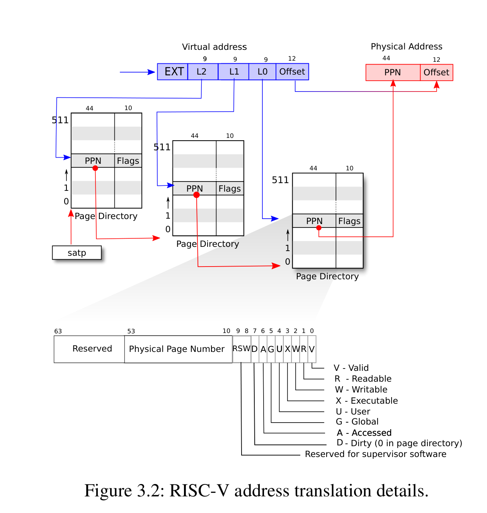

# Uno-OS

## 简介
Uno-OS是一个基于MIT的xv6实验开发的，RISCV架构的简化版UNIX操作系统。

## lab-2

### 页表设计

Uno-OS仿照xv6，设计了一个Sv39的三级页表结构，页面大小为4KB（$2^{12}$字节）。这样，PPN部分就是27位，由于是三级页表，因此每个索引部分占9位，由于$4096 \div 2^9 =8$。我们可以和知道每个页表项占用8个字节，即64位，这也是`pte_t`定义为`uint64`的原因。



### 虚拟页表操作

**`pte_t *vm_getpte(pgtbl_t pgtbl, uint64 va, bool alloc)`**

根据给定的页表和虚拟地址，返回虚拟地址对应的页表项，如果alloc为true则会在找不到时进行初始化。如果失败则返回null。

我们将三级页表由高到低分别命名为第二级页表，第一级页表，第零级页表。宏`PGTABLE_TOPLEVEL`定义了顶级页表的序号，本系统中定义为2。对于给出的参数，我们首先判断他是否超过了Uno-OS所允许的最大地址，即`VA_MAX`宏。如果给出了无效的地址则直接触发`panic`。

`PGROUNDDOWN`宏可以将给出的`va`转换为页面开头的虚拟地址。

``` c
    // 虚拟地址不能大于VA_MAX
    assert(va<=VA_MAX,"vm_getpte: invalid virtual address:%x",va);

    uint64 round_va=PGROUNDDOWN(va);
    pte_t *pte=NULL;
    pgtbl_t current_pgtbl=pgtbl;
```

接下来使用for循环遍历各级页表，在寻找的过程中判断页面是否有效，若无效则根据alloc参数判断是否分配。如果不需要分配或无法分配则返回`NULL`

``` c
    for(int i=PGTABLE_TOPLEVEL;i>0;--i)
    {
        int idx=VA_TO_VPN(round_va,i);
        pte = &current_pgtbl[idx];

        // 此前该虚拟页已被分配
        if(*pte & PTE_V)
        {
            current_pgtbl=(pgtbl_t)PTE_TO_PA(*pte);
        }
        else // 否则
        {
            // 不需要分配或物理内存不足则返回NULL
            if(!alloc || (current_pgtbl=(pgtbl_t)pmem_alloc(false))==NULL)
            {
                return ((pgtbl_t)NULL);
            }
            // 分配页面
            // 此时current_pgtbl储存着新的页表，将其填充0来初始化
            memset(current_pgtbl,0,PGSIZE);
            // 原有位置的页表项应当指向新页表的地址
            *pte=PA_TO_PTE(current_pgtbl)|PTE_V;
        }
    }
```

在找到了底层页表后，返回目标页表项
``` c
    return (pte_t*)&current_pgtbl[VA_TO_VPN(va,0)];
```

**`void vm_mappages(pgtbl_t pgtbl, uint64 va, uint64 pa, uint64 len, int perm)`**

此函数在pgtbl中建立 `[va, va + len) -> [pa, pa + len)` 的映射。

该函数对参数的要求较高，首先va和pa必须是4K对齐的，然后len不能为0，最后，所有的地址必须是有效的，即，不能超过`VA_MAX`。

然后我们使用`PGROUNDDOWN`获取需要分配的最后一个页面首地址（因为`va+len-1`不一定是4K对齐的）

这样，我们获取了所有需要进行映射的页面，将其填充到`pte`中。

``` c
    for(uint64 beg=va;beg<=end;beg+=PGSIZE)
    {
        pte_t *pte=vm_getpte(pgtbl,beg,1);
        assert(pte!=NULL,"vm_mappages: cannot find pte for va:%x",beg);
        // 测试用例里面存在着这么一种特殊情况：
        // 如果之前已经存在va->pa的映射（即，想要映射到pa的va没有发生改变）
        // 那么，我们只会修改他的属性位，不要报remap错误
        assert(!(*pte&PTE_V) || (PTE_TO_PA(*pte) == pa),"vm_mappages: remap at %x",PTE_TO_PA(dst));
        *pte=PA_TO_PTE(dst)|perm|PTE_V;
        dst+=PGSIZE;
    }
```

我们还需要判断分配`pte`是否成功以及是否发生了重映射。这里有一个特例是：如果给出的va和pa本身就是存在映射关系的，那么我们的映射操作就退化为修改他的属性页。

**`void vm_unmappages(pgtbl_t pgtbl, uint64 va, uint64 len, bool freeit)`**

此函数用于取消给定页表的映射。区间为`[va, va+len)`。

大体上相当于`vm_mappages`函数的反向操作。同样的，`va`要求4K对齐。

**`void kvm_init()`**
该函数初始化内核页表。

需要映射的区域列表：
- UART_BASE
- CLINT
- PLIC
- KERNEL_BASE
- KERNEL_DATA
- 用户分配区

具体的分配地址和大小在`memlayout.h`中定义。

**`void kvm_inithart()`**
切换页表，将顶级页表的地址写入`satp`寄存器。
