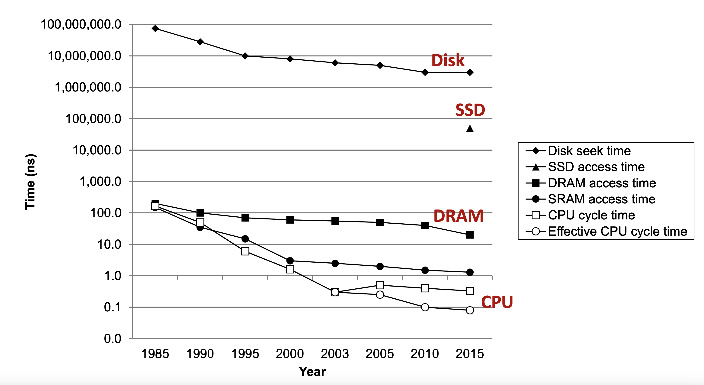

# Uno-OS

## 简介
Uno-OS是一个基于MIT的xv6实验开发的，RISCV架构的简化版UNIX操作系统。

## 睡眠锁
书接上回，我们提到，要让一个进程进入睡眠状态，需调用`sleep`函数，并提供一个`sleep_space`和对应这个`sleep_space`的锁。那么我们很自然地想到，是否可以使用一个数据结构同时管理这两个参数，这个新的数据结构就是我们的睡眠锁，它是专门用于进程的睡眠和唤醒的。与之相对应地，在此前我们曾使用系统时钟来实现进程睡眠一定时间的操作，而系统时钟显然不是专门用于进程的睡眠和唤醒的。

睡眠锁的数据结构如下：

``` c
typedef struct sleeplock {
    spinlock_t lk;
    int locked;
    char* name;
    int pid;
} sleeplock_t;
```

可以看出，`sleeplock`是基于先前的`spinlock`实现的，再来看一下获取和释放`sleeplock`的操作：

``` c
void sleeplock_acquire(sleeplock_t* lk)
{
    spinlock_acquire(&(lk->lk));
    while(lk->locked){
        proc_sleep(lk,&(lk->lk));
    }
    lk->locked=1;
    lk->pid=myproc()->pid;
    spinlock_release(&(lk->lk));
}

void sleeplock_release(sleeplock_t* lk)
{
    spinlock_acquire(&(lk->lk));
    lk->locked=0;
    lk->pid=SLEEPLOCK_INVALID_PID;
    proc_wakeup(lk);
    spinlock_release(&(lk->lk));
}
```

`sleeplock`所持有的自旋锁用于保护`sleeplock`本身（主要是他的`locked`和`pid`字段），保证唤醒信号不会丢失，而由于进入`proc_sleep`后，`sleep_space`对应的锁将被释放，因此同时有多个进程想通过同一个`sleeplock`进入睡眠时，不会被阻塞。

进程的唤醒由`sleeplock_release`将`sleeplock`的`locked`字段设置为0实现。而由于自旋锁的保护，只有一个进程会响应`locked`字段置零的操作，而这个进程响应完毕后又会将`locked`置为1，这样保证了一个`sleeplock_release`操作不会同时唤醒多个进程。

`sleeplock`这一数据结构保证了操作系统的并行性，这对于进程进行磁盘IO时进入睡眠态（或者更广义地，阻塞态）的控制是十分重要的。

## 磁盘中断的注册与处理

### 磁盘中断的注册

磁盘的IO操作是通过PLIC实现的，这需要我们在初始化时对PLIC寄存器进行写入，使其硬盘IO进入使能态。这主要涉及到[`kernel/plic/plic.c`](./kernel/plic/plic.c#8)中的操作。

### 磁盘中断的处理

由于磁盘的IO操作通过PLIC实现，因此，磁盘中断是以外部中断的形式发生的，外部中断的处理主要由`kernel/trap/trap_kernel.c`中的`external_interrupt_handler`函数完成。

我们需要判断外部中断的`irq`号以区分串口IO和磁盘IO操作。

``` c
void external_interrupt_handler()  
{  
    int irq = plic_claim(); // 获取中断号
    
    if (!irq) {
        return ;      // 中断号为0，直接忽略；
    } 
    else if (irq == UART_IRQ) 
    {  
        uart_intr(); // 调用 UART 中断处理程序 
    } else if(irq==VIRTIO_IRQ)
    {
        virtio_disk_intr();
    }
    else{
        printf("Unexpected interrupt irq = %d\n", irq);
    }

    plic_complete(irq); // 确认中断处理完成
}
```

`virtio_disk_intr`函数在[`kernel/dev/virtio.c`](kernel/dev/virtio.c#269)中实现。这一函数的许多细节与硬件底层相关，在此不作赘述。

## 磁盘读取缓冲区

各个层级之间的存储设备在访问速度上存在着指数级别的差距（见下图）

这样的差距在内存和磁盘之间体现地尤为明显，因此，尽量减少磁盘的IO操作次数可以很大程度上提高程序的性能。

类似在CPU寄存器和内存之间设计cache的操作，我们可以在内存中开辟一块空间用于缓存从磁盘中读取的数据，当需要访问磁盘时，首先检查目标数据是否存在于缓存中，若不存在则将数据从磁盘中读取到缓冲区中，再从缓冲区中读取数据。根据局部性原理，这样的操作显然可以提高系统性能。

我们在硬件层之上设计了一个缓存层，这一层主要在[`kernel/fs/buf.c`](./kernel/fs/buf.c)中实现。这样所有的磁盘IO操作都需要经过缓存层执行。

缓存的设计我们采取`LRU`和`Lazy write`策略，更进一步地提升其性能。Uno-OS启动时首先静态分配所有的缓存块（个数由[`N_BLOCK_BUF`](./kernel/fs/buf.c#7)决定）。然后，将他们组织成双向循环列表，另外分配一个用作指示的buf_node作为[整个链表的头](./kernel/fs/buf.c#19)

[`insert_head`](./kernel/fs/buf.c#23)是工具函数，用于将buf_node插入到链表中。在系统启动过程中，首先需要对buf块进行初始化，该操作由[`buf_init`](./kernel/fs/buf.c#46)函数完成。`buf_read`和`buf_write`函数分别完成对缓冲区的读和写操作。

``` c
buf_t* buf_read(uint32 block_num)
{
    buf_t *target=NULL;
    spinlock_acquire(&lk_buf_cache);

    // 首先，我们寻找是否有已经缓存了block_num块对应的buf块
    for(buf_node_t *buf_node=head_buf.next;target==NULL&&buf_node!=&head_buf;buf_node=buf_node->next)
    {
        if(buf_node->buf.block_num == block_num /*&& buf_node->buf.disk==true*/)
        {
            insert_head(buf_node, 1);
            target=&(buf_node->buf);
            target->buf_ref++;
            spinlock_release(&lk_buf_cache);
            sleeplock_acquire(&(target->slk));
        }
    }

    // 如果没找到，那么找一个空闲的buf块
    for(buf_node_t *buf_node=head_buf.prev;target==NULL&&buf_node!=&head_buf;buf_node=buf_node->prev)
    {
        // 找到一个块
        if(buf_node->buf.buf_ref==0)
        {
            insert_head(buf_node,1);
            target=&(buf_node->buf);
            // target->disk=1;
            target->block_num=block_num;
            target->buf_ref=1;
            spinlock_release(&lk_buf_cache);
            sleeplock_acquire(&(target->slk));
            virtio_disk_rw(target, 0);
        }
    }

    assert(target!=NULL, "buf_read: no buf available");
    return target;
}

// 写函数 (强制磁盘和内存保持一致)
void buf_write(buf_t* buf)
{
    assert(sleeplock_holding(&(buf->slk)),"buf_write: buf is not locked");

    virtio_disk_rw(buf, 1);
}
```

`buf_read`函数分两步执行，首先检查是否存在已经缓存了该块的buf块，如果存在则直接返回该buf块，否则寻找一个空闲的buf块。

## 文件系统初始化
在初始化文件系统时，我们主要做以下两件事：      
* 初始化缓冲区
* 从磁盘中读取superblock块，并将信息写到内存中的superblock结构中，在这里我们会检查sb的magic值和size是否合法
```c
void fs_init()
{
    buf_init();

    buf_t* buf = buf_read(SB_BLOCK_NUM);
    memcpy(&sb, buf->data, sizeof(sb));
    buf_release(buf);

    // 检查超级块的magic值是否正确，确保文件系统没有损坏
    assert(sb.magic == FS_MAGIC, "fs_init: invalid super block magic number");
    assert(sb.block_size == BLOCK_SIZE, "fs_init: invalid super block size");

    sb_print();
}
```

### bitmap 的管理
这里主要关注`bitmap_search_and_set`和`bitmap_unset`两个函数的实现。         
第一个函数`bitmap_search_and_set`：
* 将对应bitmap读取到缓冲区后，就开始遍历bitmap的每一位以找到一个空闲块，
* 找到空闲块之后，设置该块对应的位为1表示已分配
* 然后再从磁盘中读取分配的块，并返回对应的块号
* 如果没有找到空闲的块就报错
```c
// search and set bit
// 该函数用于在指定的块位图中搜索一个空闲的块 & 将其标记为已分配 & 返回该块的块号。
static uint32 bitmap_search_and_set(uint32 bitmap_block)
{
    // 从磁盘读取指定的块位图到缓冲区
    buf_t* bp = buf_read(bitmap_block);
    uint32 m, block_num;

    // 遍历整个块位图的每一位（每个 bit 对应一个块）
    for (uint32 bi = 0; bi < sb.block_size * 8; ++bi)  // sb.block_size * 8 是位图的总 bit 数
    {
        m = 1 << (bi % 8);  // 计算当前 bit 对应的掩码（每个字节有 8 个 bit）

        // 如果当前位为 0，表示该块空闲
        if ((bp->data[bi / 8] & m) == 0)   // 用bi / 8对应字节去与
        {
            // 将当前 bit 设置为 1，表示该块已分配
            bp->data[bi / 8] |= m;

            // 将更新后的位图写回磁盘
            buf_write(bp);
            buf_release(bp);

            // 分配的块号（当前位偏移量 + 位图块的起始块号）
            block_num = bi + bitmap_block;

            buf_t *buf = buf_read(block_num);
            memset(bp->data, 0, BLOCK_SIZE);
            buf_release(buf);

            return block_num;
        }
    }

    // 如果没有找到空闲块，抛出异常
    panic("bitmap_search_and_set: out of blocks");
    return -1;
}
```
函数`bitmap_unset`则是相反的操作：
* 先用`num`减去指定的bitmap起始块号，获得要释放的块的偏移量，对应前面的`block_num = bi + bitmap_block;`
* 然后将该位设置为0表示块未分配即可
```c
// unset bit
// 该函数用于在指定的块位图中释放指定的块，设置对应的位为 0（表示空闲）。
static void bitmap_unset(uint32 bitmap_block, uint32 num)
{
    // 从磁盘读取指定的块位图到缓冲区
    buf_t* buf = buf_read(bitmap_block);

    // 计算给定块号对应的位图中的偏移量
    num -= bitmap_block;

    // 计算该块在位图中的位置
    uint8 m = 1 << (num % 8);

    // 将对应的位设置为 0，表示该块已释放
    buf->data[num / 8] &= ~m;

    // 将更新后的位图写回磁盘
    buf_write(buf);
    buf_release(buf);
}
```
下面四个函数是对前面两个函数的封装，以便能区分是对data_block还是inode_block进行操作。
```c
// bitmap_alloc_block
uint32 bitmap_alloc_block()
{
    // 在数据块位图中查找并分配一个空闲块
    return bitmap_search_and_set(sb.data_bitmap_start);
}

// bitmap_free_block
void bitmap_free_block(uint32 block_num)
{
    // 在数据块位图中释放指定的块
    bitmap_unset(sb.data_bitmap_start, block_num);
}

// bitmap_alloc_inode
uint32 bitmap_alloc_inode()
{
    // 在 inode 位图中查找并分配一个空闲 inode
    return (uint32)bitmap_search_and_set(sb.inode_bitmap_start);
}

// bitmap_free_inode
void bitmap_free_inode(uint32 inode_num)
{
    // 在 inode 位图中释放指定的 inode
    bitmap_unset(sb.inode_bitmap_start, inode_num);
}
```
函数`bitmap_print`用于调试，他会从磁盘中读取指定的bitmap，然后遍历每个位，输出bitmap中每个block的分配情况。
```c
void bitmap_print(uint32 bitmap_block_num)
{
    // 从磁盘读取指定的块位图到缓冲区
    buf_t* buf = buf_read(bitmap_block_num);

    // 打印该位图中所有位
    printf("bits in bitmap %d:\n", bitmap_block_num);
    for (uint32 i = 0; i < sb.block_size * 8; i++) {
        uint8 m = 1 << (i % 8);

        // 如果当前位为 1，表示该块已分配
        if ((buf->data[i / 8] & m) != 0) 
            printf("Bit %d is alloced\n", i);
            
    }
    buf_release(buf);
}
```