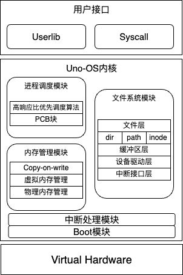

# Uno-OS

### 所属学校：华东师范大学

### 比赛方向：小型内核实现

### 队伍编号：T202410269994240

### 队伍名称：Uno-OS

### 队伍成员：季子墨、李彤

### 指导老师：石亮

## 简介
UNO-OS是一款RISCV平台的，宏内核操作系统，该内核部分参考了Linux和xv6的设计逻辑，同时也加入了一系列新的设计理念。

以下为Uno-OS系统的结构概览



详细架构如下
```
./kernel/
├── boot    # 启动模块
│   ├── entry.S                     # 用于加载start函数
│   ├── main.c                      # 内核入口函数，完成必要的初始化工作
│   ├── start.c                     # start函数，完成从M模式向S模式的跳转
│   └── Makefile
├── dev     # 设备和驱动模块
│   ├── console.c                   # 控制台设备
│   ├── plic.c                      # 处理PLIC外设中断
│   ├── timer.c                     # 系统时钟模块
│   ├── uart.c                      # 处理UART外设中断
│   ├── virtio.c                    # qemu虚拟IO接口
│   └── Makefile
├── fs      # 文件和IO模块
│   ├── bitmap.c                    # 文件系统中的bitmap模块
│   ├── buf.c                       # IO模块的缓冲层
│   ├── dir.c                       # 文件目录模块
│   ├── file.c                      # 文件结构抽象模块
│   ├── fs.c                        # 文件系统的管理
│   ├── inode.c                     # 索引节点的管理
│   └── Makefile
├── lib     # 相关的实用工具库
│   ├── print.c                     # 打印和调试
│   ├── sleeplock.c                 # 睡眠锁
│   ├── spinlock.c                  # 自旋锁
│   ├── str.c                       # 字符串操作
│   └── Makefile
├── mem     # 内存管理模块
│   ├── kvm.c                       # 内核内存管理
│   ├── mmap.c                      # 内存直接映射管理
│   ├── pmem.c                      # 物理内存分配管理
│   ├── uvm.c                       # 用户页表管理
│   └── Makefile
├── proc    # 进程管理模块
│   ├── cpu.c                       # cpu管理模块
│   ├── exec.c                      # elf程序执行模块
│   ├── proc.c                      # 进程调度模块
│   ├── swtch.S                     # 上下文切换
│   └── Makefile
├── syscall # 系统调用管理模块
│   ├── syscall.c                   # 系统调用处理
│   ├── sysfile.c                   # 文件相关系统调用
│   ├── sysproc.c                   # 进程相关系统调用
│   └── Makefile
├── trap    # 中断处理模块
|   ├── trampoline.S                # 内核态和进程态切换的处理
|   ├── trap_kernel.c               # M模式中断处理
|   ├── trap.S                      # 进行上下文切换相关工作
|   ├── trap_user.c                 # S模式中断处理
|   └── Makefile
├── Makefile
└── kernel.ld
```

## 开发环境

我们使用Ubuntu 22.04/Ubuntu24.04和QEMU-riscv 5.1.0开发完成

## 运行方法

Uno-OS 系统的构建和运行相关参数写在 Makefile 中，要运行该系统，在命令行下输入：
``` bash
$ make qemu
```
即可运行系统

## 完成情况

目前已经完成了boot模块，中断处理模块，内存管理模块，进程调度模块，文件系统模块这些操作系统所必备的模块和功能，此外，我们实现了数十条常用的系统调用。

- 中断处理模块：参考xv6中的中断处理实现，处理了时钟中断以及PLIC和CLINT中断
- 内存管理模块：实现了COW策略，设计了一个支持栈，堆和mmap的虚拟内存系统
- 进程调度模块：实现了高响应比优先（HRRN）调度算法
- 文件系统模块：实现了类似linux下ext2的文件系统，支持文件创建，删除，读写等操作

在实现上述模块的同时，为了保证系统的稳定性，我们还进行了大量的测试，包括内核态的测试和用户态的测试。

## 开发历程

截至12月24日，该系统总共经历了100余次修改（以commit次数计算）。可以参考我们的[commit记录](https://gitlab.eduxiji.net/T202410269994240/project2608132-270520/-/commits/master)

总的代码量约为6000行（去除注释）

以下为各个版本完成的工作：
|版本号|完成内容|分支链接|
|:---:|:---:|:---:|
|v-0.1alpha|完成boot模块并实现必要的库|[gitlab](https://gitlab.eduxiji.net/T202410269994240/project2608132-270520/-/tree/v-0.1alpha)|
|v-0.2alpha|完成虚拟内存模块|[gitlab](https://gitlab.eduxiji.net/T202410269994240/project2608132-270520/-/tree/v-0.2alpha)|
|v-0.3alpha|完成中断处理模块|[gitlab](https://gitlab.eduxiji.net/T202410269994240/project2608132-270520/-/tree/v-0.3alpha)|
|v-0.4alpha|完成进程结构的设计|[gitlab](https://gitlab.eduxiji.net/T202410269994240/project2608132-270520/-/tree/v-0.4alpha)|
|v-0.5alpha|完成进程调度模块|[gitlab](https://gitlab.eduxiji.net/T202410269994240/project2608132-270520/-/tree/v-0.5alpha)|
|v-0.6alpha|完成磁盘底层操作接口|[gitlab](https://gitlab.eduxiji.net/T202410269994240/project2608132-270520/-/tree/v-0.6alpha)|
|v-0.7alpha|完成文件系统模块|[gitlab](https://gitlab.eduxiji.net/T202410269994240/project2608132-270520/-/tree/v-0.7alpha)|
|v-0.8alpha|完成基础的系统调用|[gitlab](https://gitlab.eduxiji.net/T202410269994240/project2608132-270520/-/tree/v-0.8alpha)|
|v1.0(master)| 实现了COW和高响应比优先调度算法|[gitlab](https://gitlab.eduxiji.net/T202410269994240/project2608132-270520/-/tree/master)|

## 创新点

我们实现的创新点包括但不限于：
- 实现了 COW 策略
- 实现了类似 UNIX 下的多级索引文件结构
- 实现了高响应比优先（HRRN）算法
- 优化磁盘缓冲区算法，保证即使在最坏情况下也只需遍历一次链表

## 预计实现的新功能

- 实现UNIX下的管道机制
- 实现懒分配策略
- 进行更加完备的测试
- 实现更多系统调用

上述内容详见[UNO-OS内核设计手册](./UNO-OS内核设计手册.pdf)

## 参考工作
- [ecnu-oslab](https://gitee.com/HaoDong-Xia/ecnu-oslab.git)
- [xv6-labs-2020](https://github.com/mit-pdos/xv6-public)

