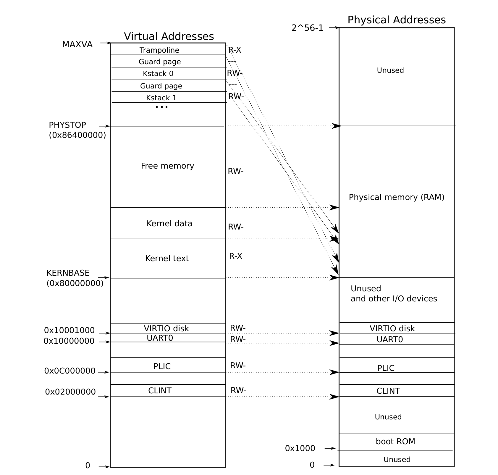
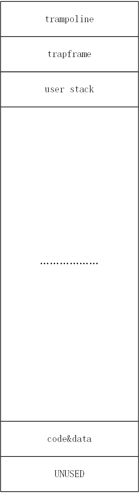

# Uno-OS

## 简介
Uno-OS是一个基于MIT的xv6实验开发的，RISCV架构的简化版UNIX操作系统。

## 初始化第一个进程的结构

### 页表的结构

#### 内核页表
相较于之前一直运行在S模式下的内核，想要从S模式跳转到U模式进入用户进程，我们需要向内核页表添加如下几个部分的映射：

- trampoline 存储用于在S模式和U模式之间来回切换的代码（事实上，即`kernel/trap/trampoline.S`中的`user_vector`）
- kstack 存储进程的内核栈，每个`KSTACK`拥有一个标号，这个标号对应其所属进程的`pid`，这个区域用来存储系统调用过程中的临时变量。

这两个区域的映射放在内核页表的最高位置，将其位置与用户进程尽可能远的分开，从而避免意外地修改了内核代码，从而，内核页表的结构如下图：



注意到图中的`guard_page`，这是一种用来防止意外修改`kstack`和`trampoline`区域的方法，实现这个`guard_page`的方法是将`KSTACK(id)`宏定义如下：
``` c
#define KSTACK(id) (TRAPFRAME - ((id) + 1) * 2 * PGSIZE)
```
这个*2可以保证`kstack`之间，`kstack`和`trampoline`之间，均存在一个`guard_page`。

由于这两个区域需要在内核页表中映射，因此我们在`kernel/mem/kvm.c`中添加如代码：
``` c
// 对每个进程，初始化他的内核栈位置。
void kstack_init()
{
    // 当前只有一个进程，所以只要初始化一个即可
    vm_mappages(kernel_pgtbl, KSTACK(0), (uint64)pmem_alloc(true), KSTACK_SIZE, PTE_R | PTE_W);
}

// 完成 UART CLINT PLIC 内核代码区 内核数据区 可分配区域 的映射
// 相当于填充kernel_pgtbl
void kvm_init()
{
    // 同前，省略

    vm_mappages(kernel_pgtbl, TRAMPOLINE, (uint64)trampoline, TRAMPOLINE_SIZE, PTE_R|PTE_X);

    kstack_init();
}
```
由于`trampoline`中放置的是代码，因此必须带有`PTE_X`标志以允许执行
同样的，`kstack`是数据区域，因此需要具有读写的权限

### 用户页表
用户页表有一部分和内核页表相同，剩下的是当前进程所独享的，我们创建的第一个进程的页表结构如下：



我们依次介绍各个区域的功能

- trampoline 和内核页表中的相同
- trapframe 用来保存优先级切换时的寄存器信息，便于恢复中断发生前的上下文状态
- user stack 用户栈，保存进程的局部变量等
- code&data 进程的数据区和代码区，正常情况下这两个应该是分开的，但是由于我们当前需要实现的内容较为简单，因此合并，我们将他们又称作堆区，注意到栈向下生长而堆向上生长，这样的内存分布有利于我们充分利用虚拟地址空间
- unused 虚拟地址空间中最开始的一页，保留之

我们在`kernel/proc/proc.c`中，使用`proc_pgtbl_init`和`load_initcode`两个函数进行相关区域的映射：
``` c
// 获得一个初始化过的用户页表
// 完成了trapframe 和 trampoline 的映射
pgtbl_t proc_pgtbl_init(uint64 trapframe)
{
    pgtbl_t pgtbl = pmem_alloc(true);
    memset(pgtbl, 0, PGSIZE);
    vm_mappages(pgtbl, TRAMPOLINE, (uint64)trampoline, TRAMPOLINE_SIZE, PTE_X | PTE_R);
    vm_mappages(pgtbl, TRAPFRAME, trapframe, PGSIZE, PTE_W | PTE_R);

    // ustack 映射 + 设置 ustack_pages
    for (int i = 0; i < USER_STACK_INITIAL_PAGE_COUNT; ++i)
    {
        vm_mappages(pgtbl, PGROUNDDOWN(USER_STACK_BOTTOM - (i+1) * PGSIZE),
                    (uint64)pmem_alloc(false), PGSIZE, PTE_W | PTE_R | PTE_U);
    }

    proczero.tf->sp=USER_STACK_BOTTOM;
    proczero.ctx.sp=KSTACK(proczero.pid)+PGSIZE;
    proczero.ustack_pages = USER_STACK_INITIAL_PAGE_COUNT;

    return pgtbl;
}

// 将initcode加载到内存中
// pgtbl:给定的用户页表
void load_initcode(pgtbl_t pgtbl)
{
    uint64 addr=0;

    // data + code 映射
    assert(initcode_len <= PGSIZE, "proc_make_first: initcode too big\n");

    vm_mappages(pgtbl, USER_VMEM_START, addr=(uint64)pmem_alloc(false),
                PGSIZE, PTE_U | PTE_R | PTE_X | PTE_W);
    memmove((void *)addr,initcode,initcode_len);
}
```
用户栈分配的设计较复杂，主要考虑到后续的可扩展性和调优需求（初始栈大小可能不为4KB）

### proc_t结构体的初始化
除了用户页表外，我们还需要初始化进程的`proc_t`结构体，以便于进行上下文的切换以及进程的调度，目前我们的`proc_t`结构体较简单：
``` c
typedef struct proc {
    int pid;                 // 标识符

    pgtbl_t pgtbl;           // 用户态页表
    uint64 heap_top;         // 用户堆顶(以字节为单位)
    uint64 ustack_pages;     // 用户栈占用的页面数量
    trapframe_t* tf;         // 用户态内核态切换时的运行环境暂存空间

    uint64 kstack;           // 内核栈的虚拟地址
    context_t ctx;           // 内核态进程上下文
} proc_t;
```

其中`tf`和`ctx`都是用来完成上下文切换时，保存上下文的数据结构，他们之间的不同点在于：

- `tf`保存的信息较多，用于S-U模式间的上下文切换
- `ctx`保存的信息较少，用于S模式内的上下文切换。

除此之外，其他字段的作用已经在代码的注释中说明清楚。

因此，在`proc_make_first`函数中，我们只需要按部就班地完成初始化工作即可：
``` c
void proc_make_first()
{
    // pid 设置
    proczero.pid = 0;

    // pagetable 初始化
    proczero.tf = (trapframe_t *)pmem_alloc(false);
    proczero.pgtbl = proc_pgtbl_init((uint64)proczero.tf);

    // 加载程序
    load_initcode(proczero.pgtbl);

    // 设置 heap_top
    proczero.heap_top = USER_VMEM_START + PGSIZE;

    // tf字段设置
    proczero.tf->epc = (uint64)USER_VMEM_START;
    proczero.ctx.ra=(uint64)trap_user_return;

    // 内核字段设置
    proczero.kstack = KSTACK(proczero.pid);

    // 上下文切换
    cpu_t *c = mycpu();
    c->proc = &proczero;
    swtch(&(mycpu()->ctx), &(proczero.ctx));
}
```

`swtch`是用来完成S模式内部上下文切换的函数，如果想要完成S-U模式间的上下文切换，则需要使用`trap`机制。
