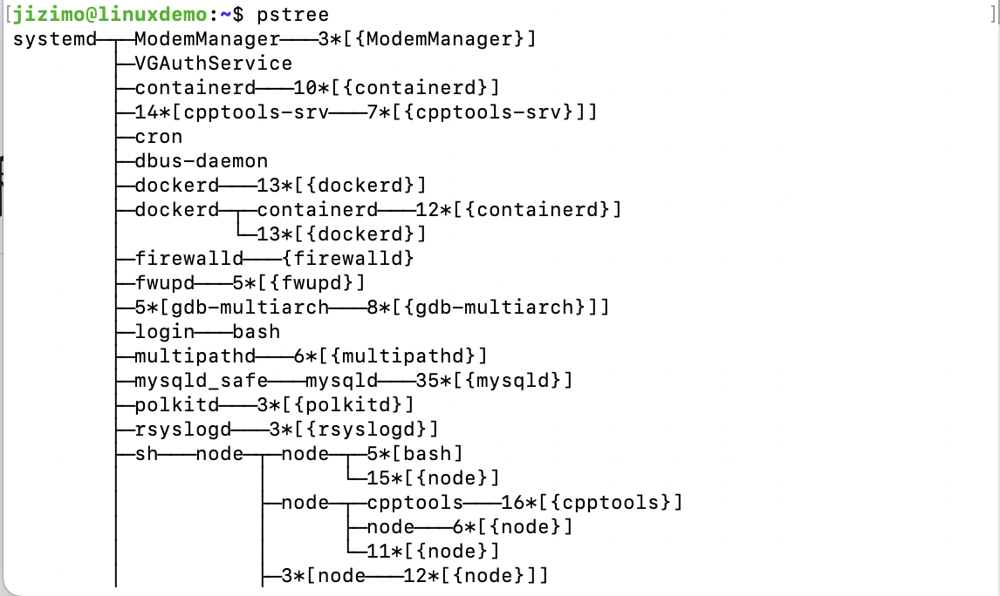

# Uno-OS

## 简介
Uno-OS是一个基于MIT的xv6实验开发的，RISCV架构的简化版UNIX操作系统。

## 进程的创建和销毁

### PCB的初始化

Uno-OS的进程PCB块全部由一个全局的PCB数组来管理，在`proc_init`中该数组被初始化，主要内容为初始化进程锁。

### 进程创建

参考xv6以及POSIX规范，在系统启动时，会首先创建一个`proczero`进程，这个进程即所谓的”根进程“。其他的进程要想被创建，必须通过`fork`函数复制这个进程（或其他的进程），即，进程不能凭空出现。而这样复制出来的进程又自然地和先前的进程形成了父子关系，如此一来，所有的进程便构成了一种树的关系（即，进程树）。下图是使用linux的`pstree`命令显示的进程树的一部分：


在Uno-OS中fork系统调用由`proc_fork`函数完成。一般地，fork函数具有“调用一次，返回两次”的特点，在父进程中，fork会返回子进程的pid，这一点我们可以通过系统调用的返回值来完成，即，`proc_fork`函数会返回子进程`pid`，这是由于在调用`proc_fork`的过程中，父进程仍然处于`RUNNING`状态。而新创建的子进程则是处于`RUNNABLE`状态等待被调度。我们又知道当一个进程处于`RUNNABLE`状态时，其在用户态的状态会被保存在`proc->tf`中，因此我们将父进程的`tf`全部复制过来，但是设置`a0`字段为0，这样一来，我们就可以让fork系统调用在返回时，子进程返回值为0而父进程返回值为`pid`，且其他状态均相同。

以下为proc_fork函数的代码，我省略了一部分复制的内容只保留了关键部分，完整的代码参见[`proc.c`](./kernel/proc/proc.c#237)
``` c
int proc_fork()
{
    proc_t* new_proc=proc_alloc();
    assert(new_proc!=NULL, "proc_fork: no proc available");

    // 设置子进程进入用户态后的状态
    // 子进程中调用fork的返回值储存在a0中，为0
    *(new_proc->tf)=*(myproc()->tf);
    new_proc->tf->a0=0; // 子进程的返回值为0

    // ......

    // 进程状态设置
    new_proc->state=RUNNABLE;   // 设置进程可调度
    new_proc->parent=myproc();  // 设置父子关系，以构成进程树

    spinlock_release(&(new_proc->lk)); // proc_alloc返回的进程是持有锁的，这样避免其被调度

    return new_proc->pid;   // 父进程的返回值为子进程的pid
}
```

`proc_alloc`会为进程进行一些必要的资源分配，如页表映射等。

### 进程销毁

`proc_free`函数负责将不再被使用的进程销毁，他会释放掉进程由`proc_free`分配掉从而占用的资源。

## 调度算法的实现

参考xv6，我们打算实现一个时间片为1个时钟中断的RR调度算法（之后可以改进）。

进程调度实现的核心代码为`proc_scheduler`函数，但是完整的进程调度以及进程切换还涉及到其他的函数，如，进入调度器前调用的`proc_sched`函数（用于确认持有锁的状态以及保存关中断层数），用于切换上下文的`swtch`函数,以及调度返回时的`fork_return`函数（主要实现了进程锁的释放）

### `swtch`函数

`swtch`主要用于在内核态切换上下文，需要注意的是，`proc_alloc`中我们将新进程ctx的ra字段设置为`fork_return`，该函数会做一些新进程在能够被调度前的准备工作，如，它会释放掉`proc_alloc`中持有的锁。

### `proc_sched`函数

`proc_sched`函数开头用四个`assert`语句检查了一系列条件，然后保存了关中断层数的信息

``` c
void proc_sched()
{
    assert(spinlock_holding(&(myproc()->lk)), "proc_sched: Not holding lock");
    assert(mycpu()->noff==1, "proc_sched: mycpu()->noff!=1");
    assert(myproc()->state!=RUNNING, "proc_sched: proc is running");
    assert(intr_get()==0,"proc_sched: interruptible");

    // 切换上下文，
    int origin=mycpu()->origin;
    swtch(&(myproc()->ctx),&(mycpu()->ctx));
    mycpu()->origin=origin;
}
```

第一句assert确定了使用`proc_sched`准备进入调度器时，函数持有锁；然后确保当前关中断层数为1，即，关中断的层数是由于持有当前的进程锁造成的；第三步，确认当前进程状态不为`RUNNING`，在调度器中我们要求当前没有处于`RUNNING`状态的进程，否则一个cpu上会出现多个`RUNNING`状态的进程，而将当前的进程状态由`RUNNING`状态改变的操作不能由调度器完成，因为它并不知道当前进程需要进入哪个状态，因此这一更改操作必须由`proc_sched`的调用者保证；最后，确保当前中断已经被关闭，避免意外情况出现。

然后系统会保存先前的中断开关状态，通过`swtch`函数保存并切换上下文，由于先前保存在cpu的ctx字段中的上下文信息是`proc_scheduler`函数中上一次完成调度的位置，或者简单地说，`proc_scheduler`函数中[调用`swtch`的位置](./kernel/proc/proc.c#428)。然后交由`proc_scheduler`进行调度。

`proc_scheduler`的调度流程如下：
``` c
void proc_scheduler()
{
    mycpu()->proc=NULL;//当前没有正在执行的进程
    int found=0;
    proc_t* p=NULL;
    while(1)
    {
        // 开中断以避免死锁的发生
        intr_on();

        found=0;
        for(int idx=0;idx<NPROC;++idx)
        {
            p=&procs[idx];
            spinlock_acquire(&(p->lk));
            if(p->state==RUNNABLE)
            {
                printf("proc %d running\n",p->pid);
                p->state=RUNNING;
                mycpu()->proc=p;

                // 切换到p执行
                swtch(&(mycpu()->ctx),&(p->ctx));

                //发生进程调度前首先将cpu的当前proc清空
                mycpu()->proc=NULL;

                found=1;
            }
            spinlock_release(&(p->lk));
        }
    }
    if(found==0)
    {
        intr_on();
        asm volatile("wfi");// 进入低功耗模式等待可执行的进程
    }
}
```

首先，函数从上次保存的`swtch`位置开始运行，清空`mycpu()->proc`字段，然后标记`found`为1。该字段的意义为：上一次调度成功找到一个可以被调度的进程。然后将进程锁释放掉，这个锁是在调用`proc_sched`的函数中持有，并在`proc_sched`函数中确认持有状态的。该锁的存在是为了避免一个进程同时被多个cpu调度，因此，当调度器想要调度某个进程时，必须首先持有这个进程锁（由调用`proc_sched`的函数负责），当调度完毕后，再由调用`proc_sched`的函数释放掉。总的来说，进程锁会在函数间传递。如果某个函数试图调用`proc_sched`，那么它首先持有当前进程的锁。当进程被`proc_scheduler`调度后，`proc_scheduler`保证持有该锁，然后返回原来的函数，由原来的函数释放锁，这样可以避免（极低概率的）进程被多个cpu调度。

## 简单的进程间通信操作(`proc_wait`,`proc_sleep`,`proc_wakeup`,`proc_exit`)

### `proc_sleep`,`proc_wakeup`

`proc_sleep`接受两个参数，第一个参数指示睡眠区域，这个参数与`proc_wakeup`相关。`proc_wakeup`接受同样的一个，被称为睡眠区域的参数，当调用`proc_wakeup`时，它尝试唤醒所有具有给定的睡眠区域的，处于睡眠状态的进程。

`proc_sleep`的第二个参数是和当前睡眠区域相匹配的一个锁，这个锁可以保证与前面的睡眠区域相关的`wakeup`信号不会丢失，避免进程无限期等待下去。而当进入了`proc_sleep`函数后，`proc_sleep`会首先获得进程锁，然后再释放掉睡眠区域的锁。这个顺序是很重要的，调用`proc_wakeup`的函数会检查睡眠区域的锁是否已经取得，如果已经取得才会调用`proc_wakeup`，而`proc_wakeup`则需要取得进程锁才可以唤醒进程，因此，上面的顺序保证了，当释放睡眠区域锁时，即使进入了`proc_wakeup`，它也会等待睡眠区域设置完成后再发送唤醒信号，避免进程无限期地等待下去。

最后，当进程被唤醒后，`proc_sleep`会获取睡眠区域锁然后释放进程锁来恢复到调用前的状态。

`proc_wakeup`的具体逻辑相较`proc_sleep`简单得多，它遍历`procs`数组并唤醒每个具有相同睡眠区域的睡眠进程。

### `proc_wait`,`proc_exit`
`proc_wait`函数是在前两个函数的基础上实现的，这个函数又是`proc_exit`实现的基础。该函数会等待任意一个子进程退出，然后将其返回值存入给定的地址中。该函数会保持睡眠，睡眠区域就是该进程自身。如果一个子进程退出了，它会在`proc_exit`函数中调用`proc_wakeup_one`唤醒该进程。

该进程从`proc_wait`中被唤醒后，会检查`procs`数组中是哪个进程退出了，然后保存它的状态，如果有两个进程都退出了，它只会保存其中一个的状态。

在`proc_exit`中还有一个较为特殊的操作，它会使用`proc_wakeup_one`唤醒`proczero`。这个操作是为了避免父进程已经退出，proczero处于睡眠状态，导致进程无法成为proczero的子进程。

## 睡眠锁（为IO做准备）


